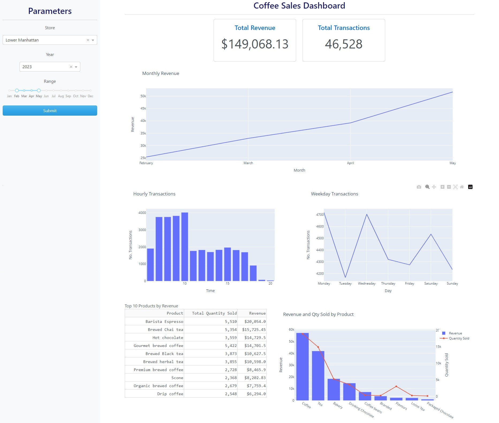

# Coffee-Sales-Dashboard

## Project Overview

This project is to present the findings of a coffee shop based on their sales. This includes what products would be sold the most, revenue genenerated, what days and hours were most popular and more. This website was created in dash which is a web application developing framework built on flask. This is coded in python and mainly focuses on visualisation of data. The website is then hosted on Heroku for its "relatively" easy setup and very help community.

- [Dataset](#dataset)
- [Project Phases](#project-phases)
  - [Phase 1 - Data Collection and Pre-processing](#phase-1---data-collection-and-pre-processing)
  - [Phase 2 - Visualisation](#phase-2---Visualisation)
  - [Phase 3 - Web Development](#phase-3---Web-Development)
  - [Phase 4 - Heroku](#phase-4---Heroku)
  - [Phase 5 - Further Work](#phase-5---Further-Work)
- [Languages](#Languages)
- [Packages](#Packages)

## Dataset

The dataset used in this project can be found [here](https://www.kaggle.com/datasets/ahmedabbas757/coffee-sales). As the description says, this dataset is retrieved from the Mavern Analytics and shows the "sales" data from the ficticious company. This data was, all things considered, very clean but still represent how the sales of a real company would look.

## Project Phases

### Phase 1 - Data Collection and Pre-processing

- Download the dataset.
- Explore the dataset.
- Pre-process the data.

### Phase 2 - Visualisation

- Feature engineering
- Group bys
- Plotly
  
### Phase 3 - Web Development

- CSS
- Dash
- Callback functions

### Phase 4 - Heroku

### Phase 5 - Further Work

## Languages

- Python
- Jupyter Notebook
- Javascript
## Packages

Main packages:
- Numpy
- Pandas
- Dash
- Plotly

